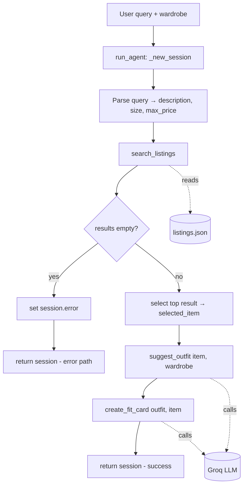

# FitFindr — planning.md

> Complete this document before writing any implementation code.
> Your spec and agent diagram are what you'll use to direct AI tools (Claude, Copilot, etc.) to generate your implementation — the more specific they are, the more useful the generated code will be.
> Your planning.md will be reviewed as part of your submission.
> Update it before starting any stretch features.

---

## Tools

List every tool your agent will use. For each tool, fill in all four fields.
You must have at least 3 tools. The three required tools are listed — add any additional tools below them.

### Tool 1: search_listings

**What it does:**
Searches the 40-item mock listings dataset and returns the listings that best match the user's keywords, filtered by an optional size and price ceiling, ranked best-match first. This is pure local filtering/scoring — no LLM call.

**Input parameters:**
- `description` (str, required): Keywords describing what the user wants, e.g. `"vintage graphic tee"`. Scored against each listing's `title`, `description`, and `style_tags`.
- `size` (str | None): Size to filter by, e.g. `"M"`. Case-insensitive substring match so `"M"` matches `"S/M"`. `None` skips size filtering.
- `max_price` (float | None): Inclusive price ceiling. A listing passes if `price <= max_price`. `None` skips price filtering.

**What it returns:**
A `list[dict]` of matching listings, sorted by keyword-overlap score (highest first). Each dict has the fields: `id` (str), `title` (str), `description` (str), `category` (str), `style_tags` (list[str]), `size` (str), `condition` (str), `price` (float), `colors` (list[str]), `brand` (str | None), `platform` (str). Listings scoring 0 keyword matches are dropped.

**What happens if it fails or returns nothing:**
Returns an empty list `[]` — it never raises. The caller (planning loop) is responsible for detecting the empty list, setting a helpful `session["error"]`, and stopping before `suggest_outfit` is called.

---

### Tool 2: suggest_outfit

**What it does:**
Takes the chosen thrifted item plus the user's wardrobe and asks the LLM (Groq) to propose 1–2 complete outfits, naming specific wardrobe pieces to pair with the new item.

**Input parameters:**
- `new_item` (dict): A single listing dict (the item the user is considering), as returned by `search_listings`.
- `wardrobe` (dict): A wardrobe dict shaped `{"items": [...]}`, where each item has `id`, `name`, `category`, `colors`, `style_tags`, `notes`. May be empty (`items == []`).

**What it returns:**
A non-empty `str` of outfit suggestions in natural language. If the wardrobe has items, it references them by name; if empty, it returns general styling advice for the item instead.

**What happens if it fails or returns nothing:**
If `wardrobe["items"]` is empty, it does not error — it falls back to a general-styling-advice prompt. On an LLM/API error it returns a descriptive error string rather than raising, so the loop can still surface something to the user.

---

### Tool 3: create_fit_card

**What it does:**
Turns the outfit suggestion into a short, casual, shareable social-media caption (OOTD style) for the thrifted find.

**Input parameters:**
- `outfit` (str): The outfit suggestion string produced by `suggest_outfit`.
- `new_item` (dict): The listing dict for the thrifted item — used to mention `title`, `price`, and `platform` naturally.

**What it returns:**
A `str` of 2–4 sentences usable as an Instagram/TikTok caption. Mentions the item name, price, and platform once each, captures the outfit vibe, and uses higher LLM temperature so repeated calls read differently.

**What happens if it fails or returns nothing:**
If `outfit` is empty or whitespace-only, it returns a descriptive error-message string (not a caption) and does not raise. On an LLM/API error it likewise returns an error string.

---

### Additional Tools (if any)

None for the core build. Possible stretch tool: `parse_query(query) -> dict` to extract `description` / `size` / `max_price` via the LLM instead of regex (see Planning Loop, Step 2).

---

## Planning Loop

**How does your agent decide which tool to call next?**

The loop is **deterministic and sequential** — a fixed pipeline, not an LLM choosing tools. State lives in one `session` dict (see State Management). The logic, matching `run_agent` in `agent.py`:

1. `session = _new_session(query, wardrobe)`.
2. **Parse** the query into `{description, size, max_price}` and store in `session["parsed"]`. Approach: regex/string parsing for `size` (e.g. look for an explicit size token) and `max_price` (e.g. `under $30` → `30.0`); the remaining text is the `description`. (Stretch: swap in an LLM `parse_query` tool.)
3. **Call `search_listings(**session["parsed"])`** and store in `session["search_results"]`.
   - **If `search_results` is empty:** set `session["error"]` to a helpful message (e.g. `"No listings matched 'X' under $Y in size Z — try loosening your filters."`) and **return the session early.** Do not call `suggest_outfit`.
4. **Select** the top result: `session["selected_item"] = session["search_results"][0]`.
5. **Call `suggest_outfit(selected_item, wardrobe)`** and store in `session["outfit_suggestion"]`.
6. **Call `create_fit_card(outfit_suggestion, selected_item)`** and store in `session["fit_card"]`.
7. **Return** the session. Caller checks `session["error"]` first; if `None`, it reads `outfit_suggestion` and `fit_card`.

**How does it know it's done?** There is exactly one pass through the pipeline. It terminates either at the early return in Step 3 (no results → `error` set) or after Step 6 (all three outputs populated, `error` is `None`).

---

## State Management

**How does information from one tool get passed to the next?**

A single `session` dict (created by `_new_session`) is the single source of truth for one interaction. Each step writes its output into a dedicated key, and the next step reads from it — tools never call each other directly.

| Key | Written by | Read by |
|-----|-----------|---------|
| `query` | `_new_session` | parse step |
| `parsed` (`{description, size, max_price}`) | parse step | `search_listings` |
| `search_results` (list[dict]) | `search_listings` | selection / empty-check |
| `selected_item` (dict) | selection step | `suggest_outfit`, `create_fit_card` |
| `wardrobe` (dict) | `_new_session` | `suggest_outfit` |
| `outfit_suggestion` (str) | `suggest_outfit` | `create_fit_card` |
| `fit_card` (str) | `create_fit_card` | final output |
| `error` (str \| None) | any step on failure | caller (checked first) |

The data flow is: `query → parsed → selected_item (from search_results) → outfit_suggestion → fit_card`. `wardrobe` is injected at session creation and read once by `suggest_outfit`.

---

## Error Handling

For each tool, describe the specific failure mode you're handling and what the agent does in response.

| Tool | Failure mode | Agent response |
|------|-------------|----------------|
| search_listings | No results match the query (empty list) | Loop detects `search_results == []`, sets `session["error"]` to a specific message naming the failed filters, and returns early — never calls `suggest_outfit` with empty input. |
| suggest_outfit | Wardrobe is empty (`items == []`) | Not treated as an error: the tool branches to a general-styling-advice prompt and still returns a useful non-empty string, so the pipeline continues to `create_fit_card`. |
| create_fit_card | Outfit input missing/incomplete (empty or whitespace) | Tool guards the input and returns a descriptive error-message string instead of raising; the caller can display it or fall back to showing the raw outfit suggestion. |

---

## Architecture

```
                ┌──────────────────────────────────────────────────┐
   user query   │                  run_agent()                     │
   + wardrobe ─▶│                 PLANNING LOOP                    │
                │                                                  │
                │  1. _new_session(query, wardrobe) ──┐            │
                │                                     ▼            │
                │  2. parse query ──────────▶ ┌──────────────┐    │
                │                             │   session    │    │
                │  3. search_listings ───────▶│    dict      │    │
                │        │                    │ (shared      │◀──┐ │
                │        │ empty?             │  state)      │   │ │
                │        ├── yes ─▶ set error │              │   │ │
                │        │         return ────│──────────────│─▶ END (error path)
                │        └── no               └──────────────┘   │ │
                │  4. select top result ──────────────────────────┘ │
                │  5. suggest_outfit(item, wardrobe) ──▶ session     │
                │  6. create_fit_card(outfit, item) ───▶ session     │
                │  7. return session ──────────────────────────────▶ END (success)
                └──────────────────────────────────────────────────┘
                                   │            │
                                   ▼            ▼
                          ┌─────────────┐  ┌─────────────────┐
                          │ listings.json│  │  Groq LLM API   │
                          │ (local data) │  │ (outfit + card) │
                          └─────────────┘  └─────────────────┘
   search_listings reads local data only.
   suggest_outfit + create_fit_card call the LLM.
```

Mermaid equivalent:



---

## AI Tool Plan

**Milestone 3 — Individual tool implementations:**

I'll use **Claude Code** for all three tools, one at a time, feeding it the matching planning.md tool spec plus the existing docstring/signature in `tools.py`.

- **search_listings:** Give Claude the Tool 1 spec (inputs, the field list of a returned listing, the empty-list-not-exception contract) and the `load_listings()` helper signature from `utils/data_loader.py`. Ask it to implement the filter → keyword-score → drop-zero → sort pipeline. **Verify** by running it against 3 queries before trusting it: (a) `"vintage graphic tee", max_price=30` → expect Y2K baby tee / graphic results under $30; (b) a `size="M"` filter → confirm `S/M` and `M` both pass; (c) a nonsense query like `"designer ballgown"` → expect `[]`. Spot-check the sort order is highest-score-first.
- **suggest_outfit:** Give Claude the Tool 2 spec including the empty-wardrobe fallback branch, and the wardrobe item schema. Ask it to build both prompt branches and call Groq via `_get_groq_client()`. **Verify** with `get_example_wardrobe()` (expect it to name real pieces like the baggy jeans / chunky sneakers) and with `get_empty_wardrobe()` (expect general advice, still non-empty).
- **create_fit_card:** Give Claude the Tool 3 spec including the empty-`outfit` guard and the "mention name/price/platform once each, higher temperature" requirements. **Verify** the guard returns an error string on `""`, and that two runs on the same input produce different captions.

**Milestone 4 — Planning loop and state management:**

I'll give **Claude Code** the Planning Loop section, the State Management table, and the architecture diagram, plus the `_new_session` dict and the Step 1–7 TODO already in `agent.py`. I'll ask it to implement `run_agent` exactly as the diagram branches — especially the early return when `search_results` is empty (must set `session["error"]` and not call `suggest_outfit`). **Verify** using the two cases already in `agent.py`'s `__main__`: the happy path (`"vintage graphic tee under $30"` with example wardrobe → all of `selected_item`, `outfit_suggestion`, `fit_card` populated, `error is None`) and the no-results path (`"designer ballgown size XXS under $5"` → `error` set, output fields `None`). I'll confirm state flows through the session dict and no tool calls another tool directly.

---

## A Complete Interaction (Step by Step)

Write out what a full user interaction looks like from start to finish — tool call by tool call. Use a specific example query.

**Example user query:** "I'm looking for a vintage graphic tee under $30. I mostly wear baggy jeans and chunky sneakers. What's out there and how would I style it?"

**Step 1 — Parse:** `run_agent` creates the session, then parses the query into `parsed = {description: "vintage graphic tee", size: None, max_price: 30.0}` (extracts `under $30` → `30.0`; no explicit size token found).

**Step 2 — search_listings:** Call `search_listings("vintage graphic tee", size=None, max_price=30.0)`. It filters to listings ≤ $30, scores keyword overlap against title/description/style_tags, drops zero-score items, and returns a ranked list. The "Y2K Baby Tee — Butterfly Print" ($18, tags `y2k, vintage, graphic tee`) scores high and lands at the top. Stored in `session["search_results"]`; it's non-empty, so we continue.

**Step 3 — select:** `session["selected_item"] = search_results[0]` (the Y2K baby tee).

**Step 4 — suggest_outfit:** Call `suggest_outfit(selected_item, wardrobe)` with the example wardrobe. The LLM returns outfit ideas naming real wardrobe pieces — e.g. the baby tee with the baggy straight-leg jeans and chunky white sneakers, layered under the vintage black denim jacket. Stored in `session["outfit_suggestion"]`.

**Step 5 — create_fit_card:** Call `create_fit_card(outfit_suggestion, selected_item)`. The LLM returns a casual 2–4 sentence caption mentioning the baby tee, its $18 price, and the Depop platform. Stored in `session["fit_card"]`.

**Final output to user:**
The user sees the matched find ("Y2K Baby Tee — Butterfly Print, $18 on Depop"), the styling suggestion pairing it with their baggy jeans and chunky sneakers, and a ready-to-post fit-card caption. `session["error"]` is `None`.
